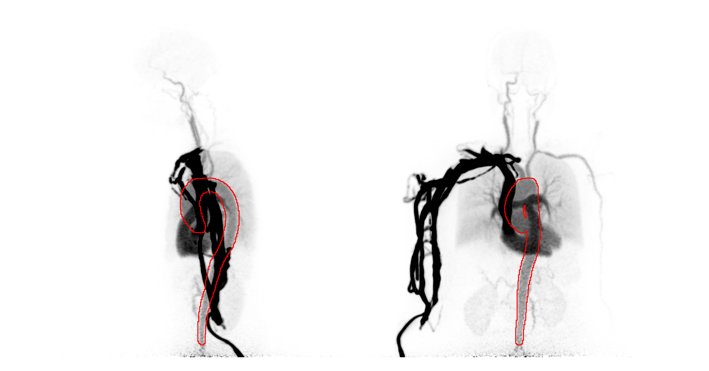

# Aorta PET Segmentation


## Installation
To install this library
```cmd
python -m venv .aortapetseg_venv # (OPTIONAL)
source .aortapetseg_venv/bin/activate # (OPTIONAL)

pip install git+https://github.com/CAAI/AortaPETSeg.git
```

Set nnU-Net environment variables (in .bashrc) ([nnUnet Documentation](https://github.com/MIC-DKFZ/nnUNet/blob/master/documentation/setting_up_paths.md))

```cmd
if [ -z ${nnUNet_raw} ]; then export nnUNet_raw="${nnUNet_raw_data_base}/nnUNet_raw"; fi
if [ -z ${nnUNet_preprocessed} ]; then export nnUNet_preprocessed="${nnUNet_raw_data_base}/nnUNet_preprocessed"; fi
if [ -z ${nnUNet_results} ]; then export nnUNet_results="${nnUNet_raw_data_base}/nnUNet_results"; fi
```

## Usage

## Preprocessing
Data must be converted to Standardized Uptake Value (SUV) of the first 40s of data.

## Citation
Please cite the main method manuscript when using our method.

Andersen TL, Evenstuen N, Ladefoged C, Lindberg U. Contrast agnostic AI-based extraction of image-derived input function from dynamic PET scans. Annual Congress of the European Association of Nuclear Medicine, October 4–8, 2025 | Barcelona, Spain, EANM Innovation, Volume 1, Supplement, 2025, 100004, ISSN 3051-2913,
[https://doi.org/10.1016/S3051-2913(25)00004-7](https://doi.org/10.1016/S3051-2913(25)00004-7).